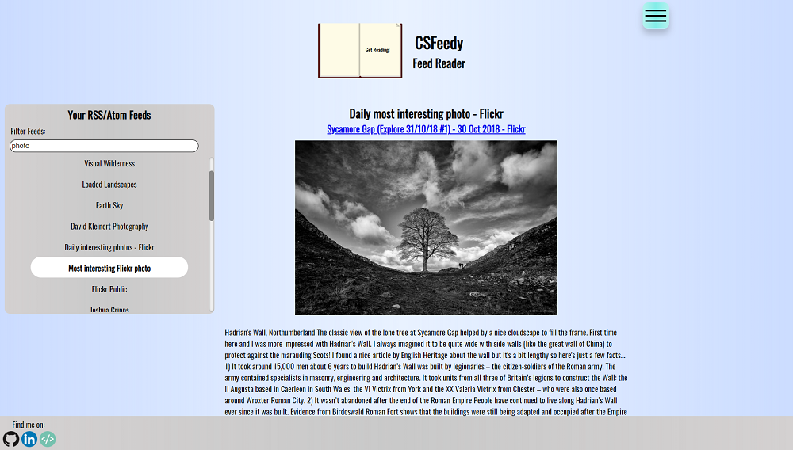
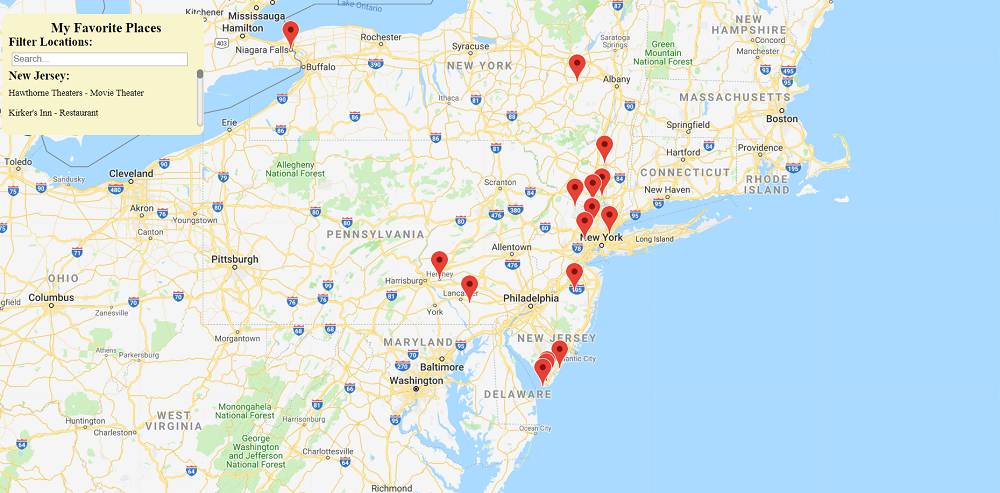
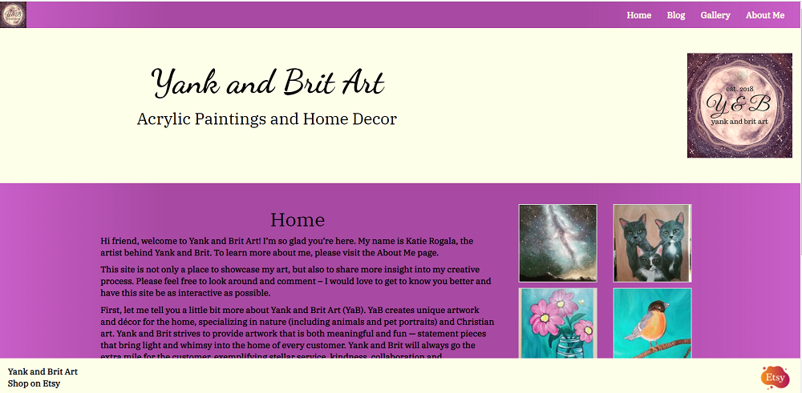

<section class="featuredwork">
	

		

			<!-- gatsby adds alt text and class names to img -->
			
			

				

					<a class="featuredwork__imgbox-overlay--link" href="https://csfeedy.surge.sh">Check out this app!</a>
				

			

		

		
Hover over the image and click link to visit the app

		<h3 class="heading-tertiary">CSFeedy</h3>
		
For those who aren’t sure, a feed reader is simply a program that allows
		users to gather and display content from numerous web sites all in one location.
		You can store hundreds of feeds in CSFeedy and see content from each web site without having to navigate
		to the sites individually. Check out this <a href="https://www.lifewire.com/what-is-rss-2483592">article</a> for some more information.

		 
		
CSFeedy (Client-Side Feed Reader) is a single page web application built with
		<a href="https://reactjs.org/">React</a> JavaScript.
		Some major dependencies are <a href="https://www.npmjs.com/package/rss-parser">rss-parser</a> to parse the
		feeds on the client’s machine and <a href="https://github.com/Rob--W/cors-anywhere">CORS Anywhere</a> proxy server
		which allows feeds to be loaded in the browser. Many thanks to the maintainers of these
		projects without whom this application wouldn’t be possible.
 
		
This project was fun and challenging to develop.
        I hope you enjoy using this application; I use it every day.
		You can read more about the development of CSFeedy on the apps about page.
		Also, feel free to check out the code for this application on its GitHub page. 
		<a href="https://github.com/ARogala/cs-feedy">View CSFeedy on GitHub</a>

	

    

		

			<!-- gatsby adds alt text and class names to img -->
			
			

				

					<a class="featuredwork__imgbox-overlay--link" href="https://arogala.github.io/FavoritePlacesMap/">Check out this app!</a>
				

			

		

		
Hover over the image and click link to visit the app

		<h3 class="heading-tertiary">Favorite Places Map</h3>
		
My Favorite Places Map was built for Udacity's Front End Nano-degree program.
        Of course, I went above and beyond the original specifications. This project was built with React, Google Maps JavaScript API,
        and the Foursquare Places API.
 
		
This app features a filterable list containing some of my favorite locations.
        Each location is displayed as a marker on the map, and clicking the marker displays an information window about the location.
        Each information window contains a link to the locations Foursquare page, a link to search the location on Google Maps,
        the locations address, and a street view of the location.
 
		
I hope you enjoy this app as much as I enjoyed making it.
        In the future I plan to make this a map share application where you can share your favorite places with friends and family. 
        <a href="https://github.com/ARogala/FavoritePlacesMap">View Favorite Places on GitHub</a>

	

	

		

			<!-- gatsby adds alt text and class names to img -->
			
			

				

					<a class="featuredwork__imgbox-overlay--link" href="https://yankandbritart.com/">Check out this web site!</a>
				

			

		

		
Hover over the image and click link to visit the site

		<h3 class="heading-tertiary">Yank and Brit Art</h3>
		
Yank and Brit Art is a custom designed art blog site; just established in 2018. This site was build on top of the WordPress content management system and the custom theme was developed with the help of Twitter Bootstrap. I developed this custom blog to help my wife, Katie, showcase her talented art work for her Etsy shop. We both enjoyed the design process and hope you enjoy browsing through the site. More content coming soon.
 
		
Full redesign with eCommerce comming soon!

	

</section>

<!-- Blank Structure below -->
<!-- 

	

		
		

			

				<a class="featuredwork__imgbox-overlay--link" href="#">Check out this app!</a>
			

		

	

	
Hover over the image and click link to visit the app

	<h3 class="heading-tertiary"></h3>
	

 
	

 
	
 
    <a href="#">View XXXXXXX on GitHub</a>

 -->
