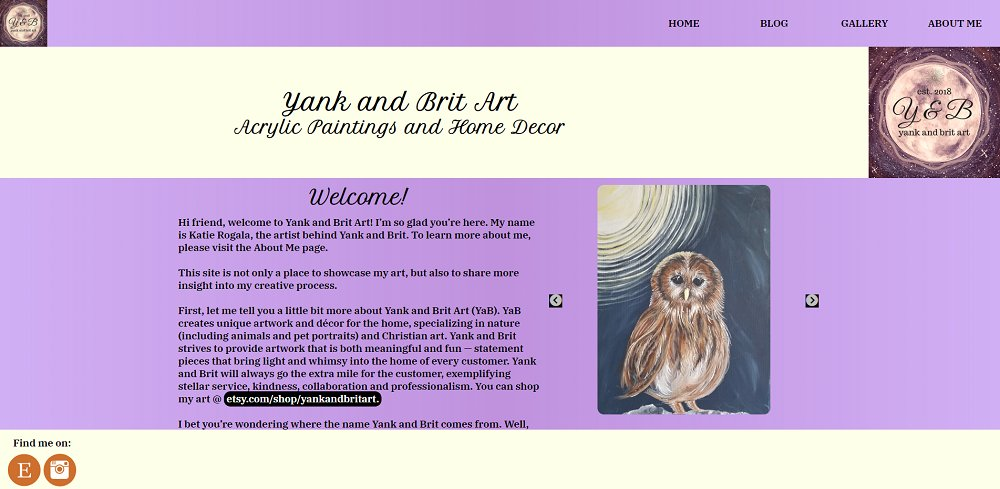

<section class="featuredwork">
	

		

			<!-- gatsby adds alt text and class names to img -->
			
			

				

					<a class="featuredwork__imgbox-overlay--link" href="https://open-recipe-db.herokuapp.com">Check out this app!</a>
				

			

		

		
Hover over the image and click link to visit the app

		<h3 class="heading-tertiary">Open Recipe Database</h3>
		
Open Recipe Database is a completely open application, meaning that anyone can add, edit, or delete recipes. I know it is a recipe for disaster; pun intended! However, I built this application to easily showcase my skills.
		
 
		
Anyway, I encourage you to add some of your favorite recipes and explore the application. For now this app is based on the honesty policy, so please DO NOT EDIT OR DELETE recipes you did not upload!! I will make database backups so all won’t be lost should someone decide to randomly delete a ton of recipes. The app is easy to use so click around and add some of your favorite recipes. Enjoy!!
 
		
This MERN application is built with MongoDB, ExpressJS, NodeJS, React, and Redux. Server testing is done with MochaJS. The MongoDB database server is hosted on <a href="https://mlab.com/">mLab</a> and will easly store over 20,000 recipes in the free sandbox!! The Express api and React frontend is hosted over on <a href="https://www.heroku.com/">Heroku.</a> Please check out further details on GitHub. <a href="https://github.com/ARogala/open-recipe-db">View Open Recipe Database on GitHub</a>

	

	

		

			<!-- gatsby adds alt text and class names to img -->
			
			

				

					<a class="featuredwork__imgbox-overlay--link" href="https://csfeedy.surge.sh">Check out this app!</a>
				

			

		

		
Hover over the image and click link to visit the app

		<h3 class="heading-tertiary">CSFeedy</h3>
		
For those who aren’t sure, a feed reader is simply a program that allows
		users to gather and display content from numerous web sites all in one location.
		You can store hundreds of feeds in CSFeedy and see content from each web site without having to navigate
		to the sites individually. Check out this <a href="https://www.lifewire.com/what-is-rss-2483592">article</a> for some more information.

		 
		
CSFeedy (Client-Side Feed Reader) is a single page web application built with
		<a href="https://reactjs.org/">React</a> JavaScript.
		Some major dependencies are <a href="https://www.npmjs.com/package/rss-parser">rss-parser</a> to parse the
		feeds on the client’s machine and <a href="https://github.com/Rob--W/cors-anywhere">CORS Anywhere</a> proxy server
		which allows feeds to be loaded in the browser. Many thanks to the maintainers of these
		projects without whom this application wouldn’t be possible.
 
		
This project was fun and challenging to develop.
        I hope you enjoy using this application; I use it every day.
		You can read more about the development of CSFeedy on the apps about page.
		Also, feel free to check out the code for this application on its GitHub page. 
		<a href="https://github.com/ARogala/cs-feedy">View CSFeedy on GitHub</a>

	

	

		

			<!-- gatsby adds alt text and class names to img -->
			
			

				

					<a class="featuredwork__imgbox-overlay--link" href="http://www.pksausage.com/">Check out this web site!</a>
				

			

		

		
Hover over the image and click link to visit the site

		<h3 class="heading-tertiary">Pork King Sausage, Inc.</h3>
		
Excited to display the first site I built for a client. This business landing page is built with GatsbyJS. I enjoyed working with the Pork King Sausage team to improve their online presence and am grateful to have my first happy customer!
 
	

	

		

			<!-- gatsby adds alt text and class names to img -->
			
			

				

					<a class="featuredwork__imgbox-overlay--link" href="https://yankandbritart.net/">Check out this web site!</a>
				

			

		

		
Hover over the image and click link to visit the site

		<h3 class="heading-tertiary">Yank and Brit Art</h3>
		
Yank and Brit Art is a custom designed art blog site; just established in 2018. This JAM Stack blog is build with GatsbyJS. I developed this custom blog to help my wife, Katie, showcase her talented art work for her Etsy shop. We both enjoyed the design process and hope you enjoy browsing through the site. More content coming soon. 
		<a href="https://github.com/ARogala/yank-and-brit-art">View code on GitHub</a>

	

	

		

			<!-- gatsby adds alt text and class names to img -->
			
			

				

					<a class="featuredwork__imgbox-overlay--link" href="https://myhomepage.surge.sh/">Check out this app!</a>
				

			

		

		
Hover over the image and click link to visit the app

		<h3 class="heading-tertiary">Custom Home Page</h3>
		
The Custom Home Page program is a single page web app built with React, Redux, and the <a href="https://openweathermap.org/">OpenWeatherMap API</a>. Building this app was fun! Some challenging aspects were: <a href="https://css-tricks.com/debouncing-throttling-explained-examples/">API request throttling</a>, and the functionality to change background image categories and select a personalized set of quick link icons.
 
		
Features include: three search bars, slide show, a custom clock with date, weather, and popular icon links. This is a redo of the first piece of code I posted on GitHub and I have learned a lot since then. 
		<a href="https://github.com/ARogala/custom-home-page">View code on GitHub</a>

	

	

		

			<!-- gatsby adds alt text and class names to img -->
			
			

				

					<a class="featuredwork__imgbox-overlay--link" href="https://beerme.surge.sh">Check out this app!</a>
				

			

		

		
Hover over the image and click link to visit the app

		<h3 class="heading-tertiary">Beer Me Drinking Game!</h3>
		
The Beer Me Drinking Game is a single page web app built with React, Redux, and the 
		<a href="https://punkapi.com/documentation/v2">PUNK API.</a> It is not my most complicated application but it was good practice with React, creative, and a fun way to find some new beers. <a href="https://github.com/ARogala/beer-me">View code on GitHub</a>
 
	

	

		

			<!-- gatsby adds alt text and class names to img -->
			
			

				

					<a class="featuredwork__imgbox-overlay--link" href="https://mytipcalc.surge.sh">Check out this app!</a>
				

			

		

		
Hover over the image and click link to visit the app

		<h3 class="heading-tertiary">Tip Calculator</h3>
		
Tip Calculator is a single page web app built with React, and Redux. This calculator goes well beyond the basic beginner tip calculator. Tip calculator allows users to calculate the tip on the before (pre) or after (post) tax amount of bills. Users can also divide the bill up between friends evenly (see basic tab) or unevenly (see Advanced tab).
 
		
 This app ended up being a little more complicated to build than I initally thought and it was a great introduction into the surprisingly complicated world of currency calculation in JavaScript; or any programming language for that matter. I made use of the wonderful <a href="https://github.com/sarahdayan/dinero.js">Dinero.js</a> library for all currency calculations in this app. <a href="https://github.com/ARogala/Tip-Calculator">View code on GitHub</a>

	

</section>

<!-- Blank Structure below -->
<!-- 

	

		
		

			

				<a class="featuredwork__imgbox-overlay--link" href="#">Check out this app!</a>
			

		

	

	
Hover over the image and click link to visit the app

	<h3 class="heading-tertiary"></h3>
	

 
	

 
	
 
    <a href="#">View XXXXXXX on GitHub</a>

 -->
