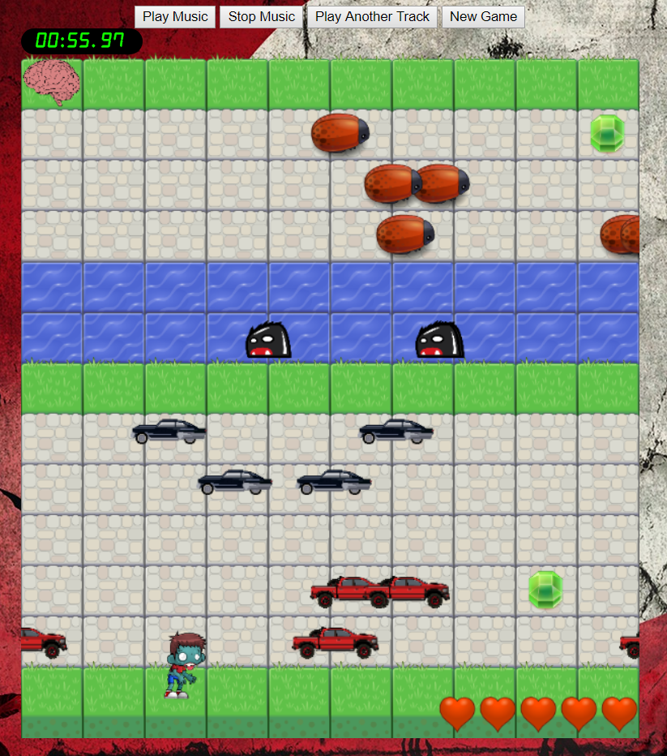
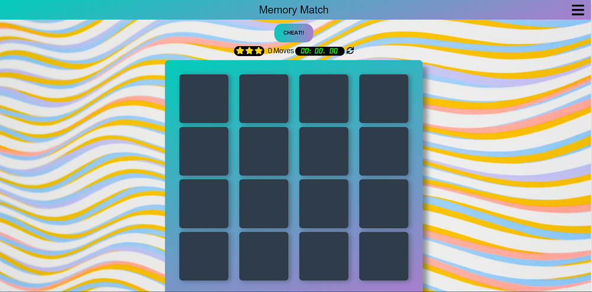
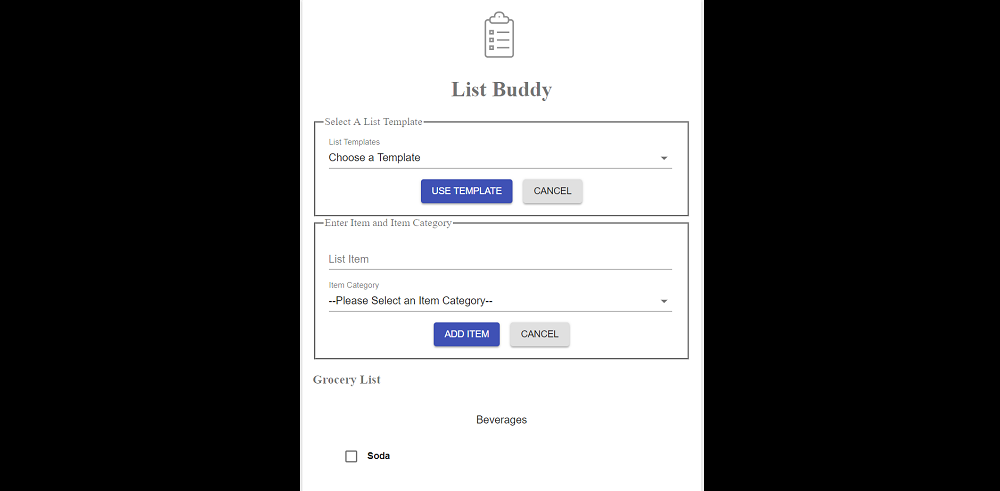
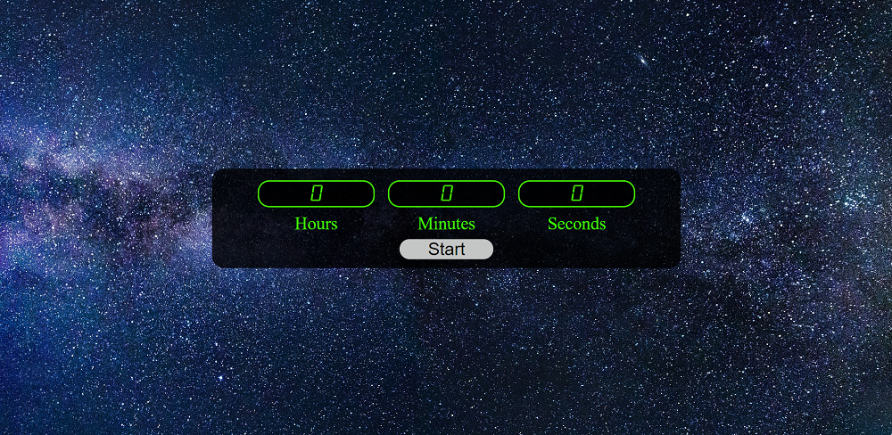
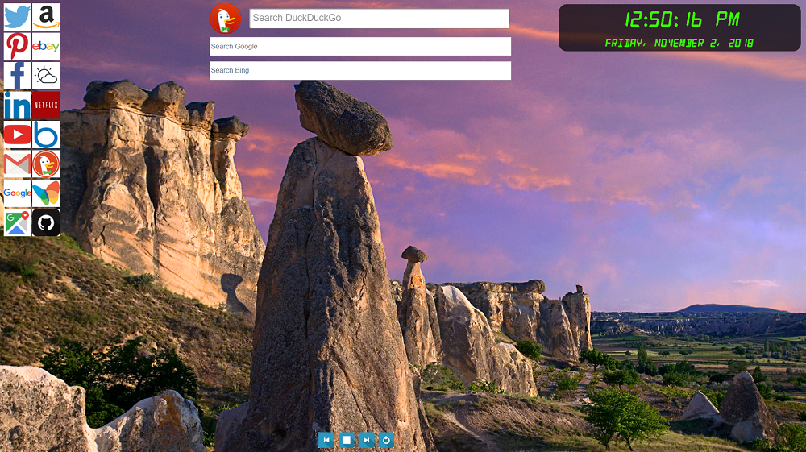

<section class="featuredwork">
	

		

			
			

				

					<a class="featuredwork__imgbox-overlay--link" href="https://andrewrogalafrogger.surge.sh">Check out this app!</a>
				

			

		

		
Hover over the image and click link to visit the app

		<h3 class="heading-tertiary">Frogger Clone</h3>
		
Zombie Squash was originally coded for Udacity's Front End Nano-degree program. It demonstrates use of object-oriented programming in JavaScript. I had a lot of fun building this game and, in the process, even learned a bit about basic game engine design.
 
		
In order to sharpen my skills and make the project uniquely mine, I added lots of addition features that were not part of the original specification. Some of the extra features include: multiple types of enemies, sound effects, music, and a bigger tile board!!
 
		
Use the arrow or wasd keys to move your player safely across the board and eat some brains!! Sorry NO mobile phone support for this game. The code and full list of game play rules are available on GitHub. 
	    <a href="https://github.com/ARogala/Frogger">View Frogger Clone on GitHub</a>

	

	

		

			
			

				

					<a class="featuredwork__imgbox-overlay--link" href="https://andrewrogalamemorygame.surge.sh">Check out this app!</a>
				

			

		

		
Hover over the image and click link to visit the app

		<h3 class="heading-tertiary">Memory Game</h3>
		
The memory game was built for Udacity's Front End Nano-degree program. I made sure to go beyond the basic requirements and added a settings page to change the tile and color theme around. The game was fun to build and works well on both desktop and mobile devices. I play it from time to time and my nieces love it. Hope you enjoy it as well. 
	    <a href="https://github.com/ARogala/fend-project-memory-game">View Memory Game on GitHub</a>

	

	

		

			
			

				

					<a class="featuredwork__imgbox-overlay--link" href="https://listbuddy.surge.sh/">Check out this app!</a>
				

			

		

		
Hover over the image and click link to visit the app

		<h3 class="heading-tertiary">List Buddy</h3>
		
The classic list application but with some extra features. List data is saved with the browser’s local storage API and list templates have been added. I wrote this little app to learn the basics of Redux and to take a tour of the Material-UI component library. I must confess Redux took me a while to understand and implement but after getting the basics down I really like it. Redux helps make data flow in React apps much clearer! I learned a lot making this little app and hope you enjoy it. I use it for making grocery lists. 
	    <a href="https://github.com/ARogala/list-buddy-redux">View List Buddy on GitHub</a>

	

	

		

			
			

				

					<a class="featuredwork__imgbox-overlay--link" href="https://arogalatimer.surge.sh">Check out this app!</a>
				

			

		

		
Hover over the image and click link to visit the app

		<h3 class="heading-tertiary">JavaScript Timer</h3>
		
I wrote this timer to demonstrate knowledge of the JavaScript language. Specifically, this timer has been coded with the modular design pattern and makes use of DOM manipulation in vanilla JavaScript. The algorithm was interesting and fun to figure out. Unfortunately, on mobile when the phone goes to sleep the script stops thus causing the timer to lose its accuracy. I am looking into a fix for this. 
	    <a href="https://github.com/ARogala/Timer">View timer on GitHub</a>

	

	

		

			
			

				

					<a class="featuredwork__imgbox-overlay--link" href="https://codepen.io/Drew7865/pen/jvGVdg">Check out this app!</a>
				

			

		

		
Hover over the image and click link to visit the app

		<h3 class="heading-tertiary">JavaScript Stop Watch</h3>
		
I wrote this stop watch to demonstrate knowledge of the JavaScript language. This stop watch has been coded with the modular design pattern and makes use of DOM manipulation in vanilla JavaScript. I spent a fair about of time on this code and tried my best to make the code clean and well commented. I have integrated this code into both of my games and hope you can make use of it too. Similar to the timer the algorithm was challenging, interesting, and fun. I may rewrite both of these as React components. 
	    <a href="https://github.com/ARogala/StopWatch">View Stop Watch on GitHub</a>

	

	

		

			
			

				

					<a class="featuredwork__imgbox-overlay--link" href="https://github.com/ARogala/PersonalHomePage">Check out this app on GitHub!</a>
				

			

		

		
Hover over the image and click link to visit the app

		<h3 class="heading-tertiary">Custom Home Page</h3>
		
The Custom Home Page program was written in JavaScript, HTML, and CSS. The idea was to have a custom home page for any internet browser on the computer. It was designed for desktop and laptop computers specifically.
 
		
Features include: three search bars, personalized slide show, a custom clock with date, and popular icon links. Check it out and feel free to use and modify to your liking. The program does require some basic knowledge to set up.
 
		
This was the first piece of code I posted on GitHub and I have learned a lot since then. I admit it needs some work, but I still use the program every day and like the concept. Updates coming soon.
 
	

</section>